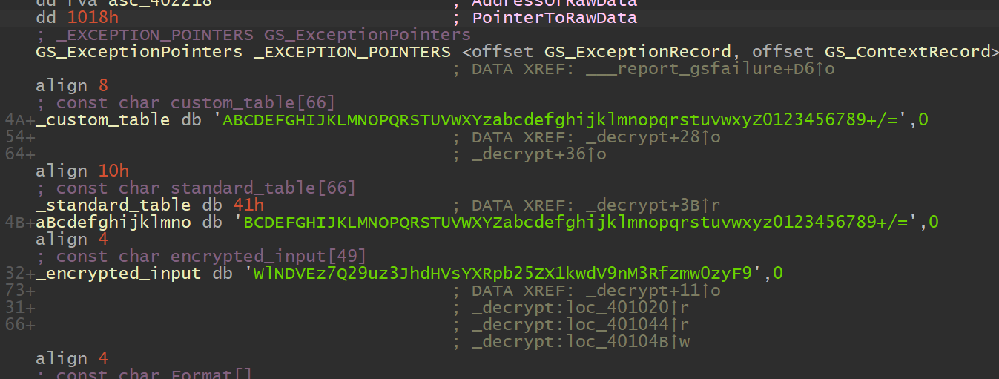

换表 base64

exp

```
import base64
code = "ABCDEFGHIJKLMNOPQRSTUVWXYzabcdefghijklmnopqrstuvwxyZ0123456789+/="
flag = "WlNDVEz7Q29uz3JhdHVsYXRpb25ZX1kwdV9nM3Rfzmw0zyF9"
coder = str.maketrans(code, "ABCDEFGHIJKLMNOPQRSTUVWXYZabcdefghijklmnopqrstuvwxyz0123456789===")
print(base64.b64decode(flag.translate(coder)))
```

flag

```
ZSCTF{Congratulations_Y0u_g3t_fl4g!}
```

