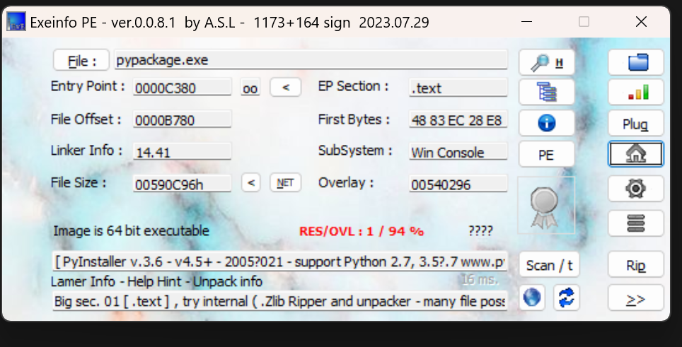
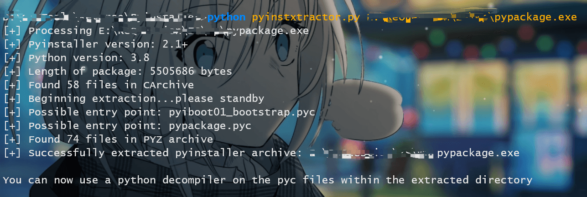
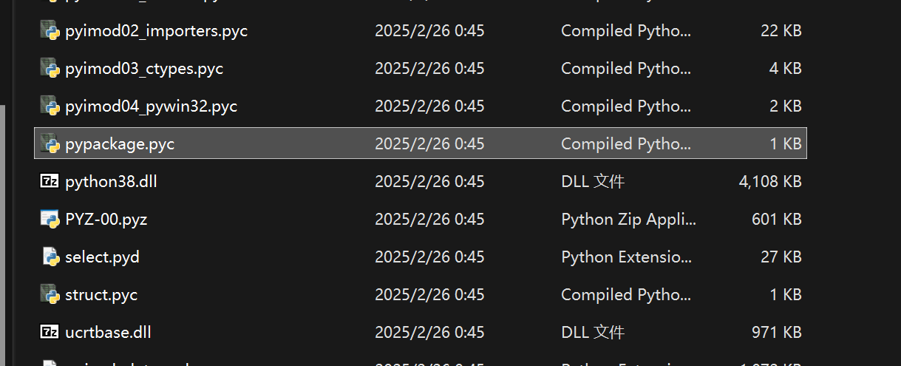
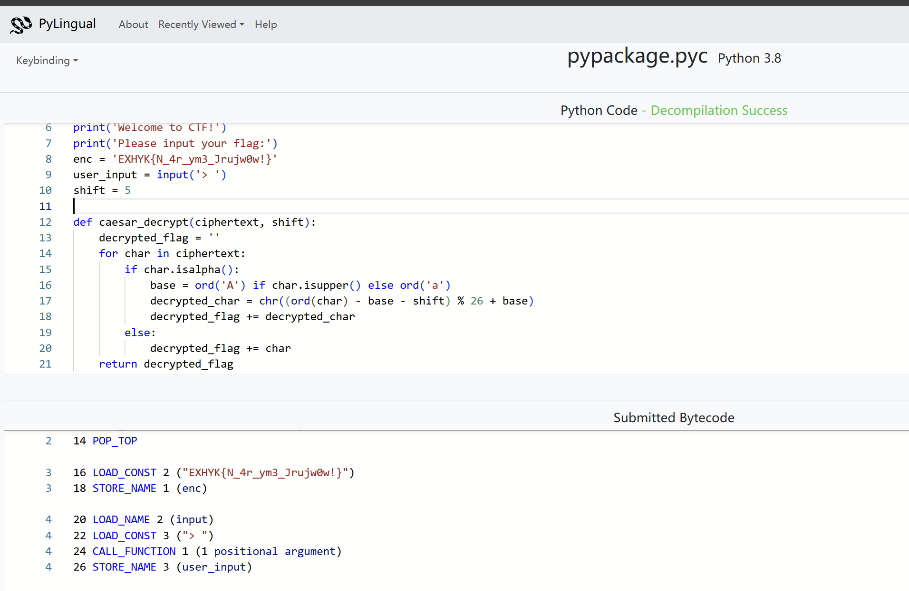

python 编译的可执行文件，先查一下类型，64 位可执行文件



可以看到有一个 `PyInstaller` 字样，用 `pyinstaller Extractor` 解包



找到 pyc 文件反编译



网上随便找个反编译就出了，推荐 https://pylingual.io/



凯撒加密，位移为 5

```
ZSCTF{I_4m_th3_Emper0r!}
```

